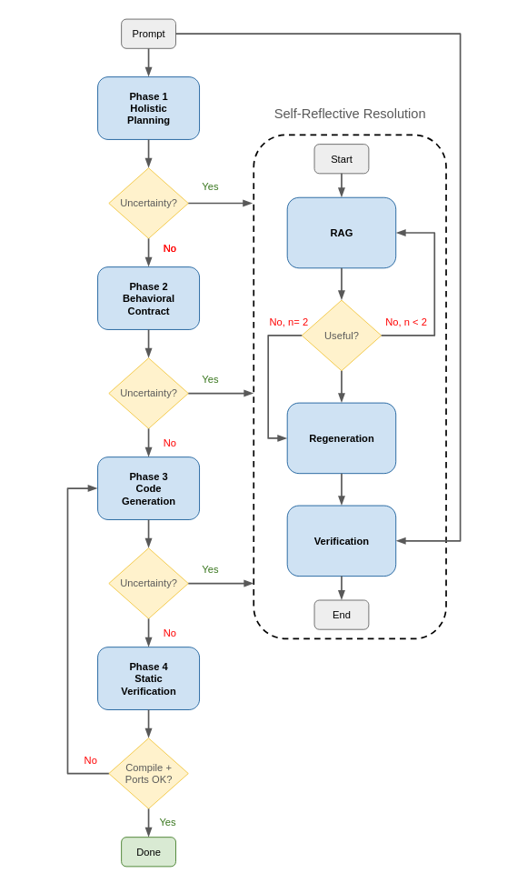

# Claude Code RLM — Verilog Hardware Generation

A **Zero-Footprint Recursive Language Model (RLM)** setup for Claude Code that generates and verifies synthesisable Verilog RTL from natural-language hardware specifications.

The orchestrator (Claude Sonnet, running inside Claude Code) drives a staged pipeline through a persistent Python REPL. Worker LLM calls are made to Claude Haiku from inside the REPL. The orchestrator never sees raw Verilog or the hardware specification, only compact metadata. Calibrated uncertainty drives a self-reflective RAG correction loop with a coopetitive research/prosecutor structure.

Inspired by:

> **Recursive Language Models** — Alex L. Zhang, Tim Kraska, Omar Khattab (MIT CSAIL) — [arXiv:2512.24601](https://arxiv.org/abs/2512.24601)

## Architecture

| RLM role | Implementation | Model |
|---|---|---|
| Root agent (orchestrator) | Main Claude Code conversation; drives the REPL via `Bash` tool | Claude Sonnet |
| Worker (planning, contract, code-gen, relevance, prosecutor) | `_call_haiku` inside `rlm_repl.py` (single-pass `claude -p ...`) | Claude Haiku |
| External environment | Persistent Python REPL (`rlm_repl.py`); state pickled to `.claude/rlm_state/state.pkl` | Python 3 |
| Verifier | `verify_verilog()` → `iverilog -g2012 -t null` | Icarus Verilog (SystemVerilog support) |
| RAG corpus | `verilog-db/` — ~40k JSON entries (module name, ports, code, description) | Local file-based |

### Key design choices

- **Zero-footprint workbench.** All LLM outputs (verbose plans, contracts, Verilog source) live exclusively in the REPL's persistent `workbench` dict. The root agent reasons over compact metadata only (paradigm labels, port lists, confidence scores, uncertainty strings). The hardware spec auto-loads into `workbench["prompt"]` on the first exec call — the root agent never `Read`s `prompt.txt` (the `Read` tool is excluded from the skill's `allowed-tools`).
- **Calibrated uncertainty.** Every gated LLM call emits a `confidence_score` (0–100) plus a list of `uncertainties`, under a hard rubric (`uncertainties != []` ⇒ score ≤ 79, programmatically clamped). The gating rule `confidence ≥ 80 AND uncertainties == []` is the only condition for accepting a phase output.
- **Two-Reading Test.** Each gated phase's prompt carries an adversarial checklist — for every spec claim the model asks "could a careful engineer reading the *same* sentence implement the *opposite* behavior?" If yes, it must be flagged. Catches MSB-first / polarity / threshold-operator / direction-specific-input ambiguities up front.
- **Spec-aware prosecutor.** When gating escalates, the SRLM loop runs (research → relevance check → regenerate → prosecutor). The prosecutor scores the regenerated artefact against the **original spec**, not against the previous candidate — catches semantic errors both candidates share.

### Pipeline



---

## Prerequisites

- [Claude Code](https://claude.ai/claude-code) CLI installed and authenticated (the worker `claude -p` calls go through the same auth)
- Python 3
- Icarus Verilog (`iverilog`, `vvp`) on `PATH` — `-g2012` enabled by default for SystemVerilog support
- The `verilog-db/` corpus (one directory up from this project) for RAG retrieval. It can be downloaded from [here](https://www.deep-chip.org/verilogdb.html).

---

## Usage

### Single problem (interactive)

The skill takes **no arguments** — write your spec into `prompt.txt` (or have the benchmark do it for you), then:

```bash
cd rtl-code-gen-with-rlm
claude
```

Inside the session:

```
/rlm
```

The pipeline runs end-to-end: Plan → Contract → Code Gen → Static Verify → Port Verify, with SRLM correction firing only when uncertainties are flagged. Output is written to `TopModule.v` in the workdir.

### Benchmark ([VerilogEval dataset](https://github.com/NVlabs/verilog-eval))

```bash
# Run all problems
python3 benchmark_rlm.py

# Run a window of problems
python3 benchmark_rlm.py --start-from 100 --limit 20

# Full options
python3 benchmark_rlm.py --help
```

The benchmark:
1. Resets the REPL state and `sub_llm_logs/` before each problem.
2. Writes `system_prompt.txt + spec` to `prompt.txt`.
3. Invokes Claude with `--output-format stream-json --verbose` so the entire root-agent trace is captured.
4. Runs the generated Verilog through iverilog/vvp against the reference testbench.
5. Records pass/fail in `results_rlm.csv` and copies all artefacts (generated Verilog, root-agent trace, per-call sub-LLM traces) to `generated_rlm/<problem_name>/`.

A baseline single-shot generator is also provided for comparison:

```bash
python3 benchmark_baseline.py --start-from 1 --limit 10
```

Results land in `results_baseline.csv` / `generated_baseline/`.

---

## REPL primitives (injected into every `exec` block)

| Function | Purpose |
|---|---|
| `workbench` | Persistent dict; all artefacts live here |
| `sub_llm(input, target_key)` | One Haiku call; parses ```summary``` JSON + ```output``` body; returns `{key, length, confidence, uncertainties}` |
| `generate_rtl(spec, target_key)` | Same as `sub_llm` but injects `workbench["prompt"]` and extracts the Verilog body |
| `write(filename, source_key)` / `read(filename, target_key)` | Move data between workbench and disk |
| `extract_verilog(text)` | Pull `​```verilog ... ```` from a string |
| `verify_verilog(file_path)` | `iverilog -g2012 -t null` check; returns `{success, returncode, stdout, stderr}` |

CLI commands (outside `exec`):

```bash
python3 .claude/skills/rlm/scripts/rlm_repl.py status --show-keys   # inspect workbench (after first exec)
python3 .claude/skills/rlm/scripts/rlm_repl.py reset                # delete state.pkl
python3 .claude/skills/rlm/scripts/rlm_repl.py verify TopModule.v   # standalone iverilog check
```

---

## Important: paths with spaces

If your project directory contains spaces (e.g. `Winter 2026/Project/`), always invoke `rlm_repl.py` via its **relative path** from the workdir:

```bash
# Correct
python3 .claude/skills/rlm/scripts/rlm_repl.py exec -c "..."

# Wrong — absolute paths with unescaped spaces will misparse
python3 /home/user/Winter 2026/Project/rtl-code-gen-with-rlm/.claude/...
```

This rule is enforced by `CLAUDE.md` so the orchestrator never constructs absolute paths.

---

## Logging

Every Haiku call writes two files under `.claude/rlm_state/sub_llm_logs/`:

- `NNNN_<target_key>.jsonl` — raw stream-json events (thinking blocks, tool calls, tool results, final result)
- `NNNN_<target_key>.txt`   — human-readable rendering of the same events

Where `NNNN` is a monotonic per-state counter (e.g. `0001_plan.jsonl`, `0002_contract_topmodule.jsonl`, `0003_topmodule.jsonl`, `0004_srlm_check_topmodule.jsonl`, ...). The benchmark copies these into the per-problem output directory so traces survive across problems.

---

## Security warning

**This project is not intended for production use.**

The benchmark and inner Haiku calls invoke `claude --dangerously-skip-permissions`, which lets Claude execute commands (Bash, Read, Write, etc.) without confirmation. When running it:

- Always run inside an isolated project directory.
- Never point the workdir at a folder containing credentials or sensitive data.
- The REPL itself runs arbitrary Python via `exec`. Treat it as code you wrote.
